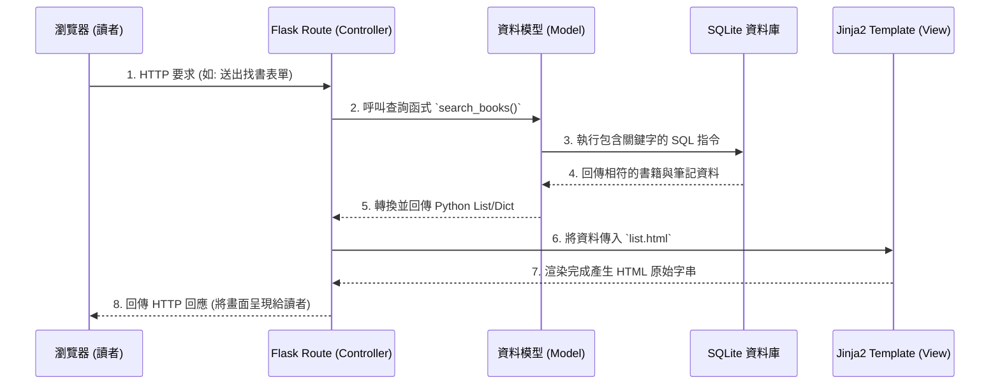

# 系統架構設計文件 (Architecture) - 讀書筆記本系統

本文件依據 PRD 需求，規劃「讀書筆記本系統」的技術架構、資料夾結構與元件之間的職責劃分，以作為開發階段的指導原則。

## 1. 技術架構說明

本專案採用伺服器端渲染 (Server-Side Rendering, SSR) 架構，不特別切分純前端應用，透過 Flask 框架結合 Jinja2 模板直接輸出完整的網頁結構。

### 選用技術與原因
- **後端：Python + Flask**
  - **原因**：Flask 是輕量級、極具彈性的 Web 框架，學習曲線平滑，非常適合打造聚焦於內容管理與 CRUD 的中小型應用。
- **前端模板引擎：Jinja2**
  - **原因**：與 Flask 高度整合，能直接將 Python 的後端資料傳遞並渲染在 HTML 上，不需建置繁重的前端框架流程（如 React/Vue）。
- **資料庫：SQLite**
  - **原因**：由於資料結構單純（只有書籍與筆記）、不需要額外安裝資料庫伺服器（Standalone server）。SQLite 儲存於單一 `.db` 檔案中，在大部分中小型專案或校園內低併發的環境中效能表現卓越且好維運。

### Flask MVC 模式說明
雖然 Flask 不強制規範設計模式，但我們將依循經典 MVC 的職責分離概念：
- **Model (模型)**：負責與 SQLite 溝通，執行所有 SQL 查讀寫刪，確保 Controller 不會混雜資料庫語法。
- **View (視圖)**：Jinja2 HTML 模版與對應的 CSS 樣式，負責接收來自 Controller 的數據，呈現美觀的排版給讀者。
- **Controller (控制器)**：定義在 `routes/` 下的 Flask URL 路由函式，負責解析使用者的請求 (HTTP Request)，調用 Model 取資料，並決定渲染哪一個 View。

## 2. 專案資料夾結構

為了讓程式碼好管理並將職責分開，建議建立以下的資料夾結構：

```text
web_app_development/
├── app/
│   ├── models/           ← 資料庫模型 (處理所有 DB 操作)
│   │   ├── __init__.py
│   │   └── db_manager.py
│   ├── routes/           ← Flask 路由控制器 (處理瀏覽器請求)
│   │   ├── __init__.py
│   │   └── book_routes.py
│   ├── templates/        ← Jinja2 HTML 模板
│   │   ├── base.html     ← 共用版型 (帶有導覽列與共同樣式)
│   │   ├── list.html     ← 搜尋與筆記本首頁
│   │   └── detail.html   ← 呈現單一書籍詳細筆記與摘錄的頁面
│   └── static/           ← 靜態資源
│       ├── css/
│       │   └── style.css ← 客製化設計樣式
│       └── js/
│           └── script.js ← 網頁互動腳本
├── instance/
│   └── database.db       ← SQLite 資料庫檔案 (運行時產生)
├── docs/                 ← 專案文件 (PRD、架構圖、流程圖等)
│   ├── PRD.md
│   └── ARCHITECTURE.md
├── app.py                ← 整個系統的總入口點 (啟動伺服器)
└── requirements.txt      ← 開發所需 Python 套件清單
```

## 3. 元件關係圖

以下使用序列圖說明當讀者操作時，各個系統元件之間是如何互動的：



## 4. 關鍵設計決策

1. **集中式路由維護與藍圖 (Blueprints)**
   - **原因**：為了避免把所有的 `@app.route` 擠在同一個 `app.py` 中造成日後難以修改，我們規劃獨立的 `routes/` 目錄，專注處理不同資源。這能有效提升後端團隊的協作效率。
2. **使用繼承機制的 Base Template**
   - **原因**：定義並使用共同的 `base.html` 來管理 `<head>` 中的資源載入（CSS/Fonts）以及網站的 Header/Footer，能保證每一頁的美觀一致性。這也減少了未來若要全站修改主題時的工作量。
3. **資料存取層的抽象化**
   - **原因**：資料庫操作統一在 `models/` 以特定函式介面呼叫。如果未來隨著專案演進需要從 SQLite 換到 PostgreSQL，只要改 `models/` 檔案，而 `routes/` 檔案完全不用修改。
4. **前端 CSS 設計優先考量**
   - **原因**：我們致力於推動具有現代感與動態的設計美學，因此獨立的 `static/css` 將有結構化的樣式定義與互動式動畫，而不是依賴內嵌或預設的陽春樣式，確保達成「Premium Design」的目標。
