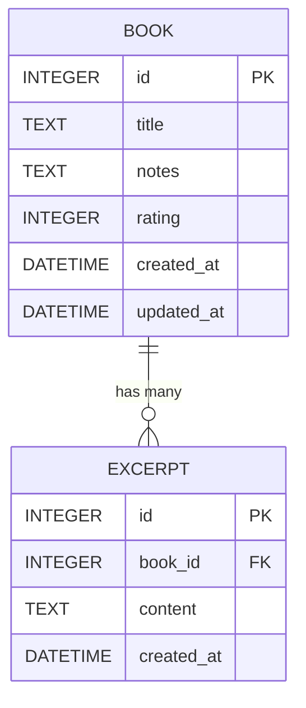

# DB Design - 讀書筆記本系統資料庫設計

## 1. ER 圖（實體關係圖）

## 2. 資料表詳細說明

### 2.1 BOOK (書籍資料表)
儲存書籍的基本資料、閱讀心得與評分。

| 欄位名稱 | 型別 | 必填 | 說明 |
| --- | --- | --- | --- |
| `id` | INTEGER | 是 | Primary Key, 自動遞增的唯一識別碼 |
| `title` | TEXT | 是 | 書名 |
| `notes` | TEXT | 否 | 長篇閱讀心得 |
| `rating` | INTEGER | 否 | 1 到 5 的評分 |
| `created_at` | DATETIME| 是 | 建立時間 |
| `updated_at` | DATETIME| 是 | 最後修改時間 |

### 2.2 EXCERPT (重點摘錄資料表)
儲存書籍對應的重點知識或名言佳句，與 `BOOK` 為多對一關聯。

| 欄位名稱 | 型別 | 必填 | 說明 |
| --- | --- | --- | --- |
| `id` | INTEGER | 是 | Primary Key, 自動遞增 |
| `book_id` | INTEGER | 是 | Foreign Key, 對應到 `BOOK.id` |
| `content` | TEXT | 是 | 摘錄或佳句內容 |
| `created_at` | DATETIME| 是 | 建立時間 |

## 3. 欄位命名原則與約束
- 所有資料表都有 `id` 作為主鍵。
- 時間戳記使用 SQLite 內建的 `DATETIME DEFAULT CURRENT_TIMESTAMP`。
- 欄位命名全面採用 `snake_case`。
- 對於評分 (`rating`) 增加 SQLite層級的 `CHECK` 約束（只允許 1 到 5 之間的值）。
- `EXCERPT` 的 `book_id` 設定了 `ON DELETE CASCADE`，當書籍被刪除時，關聯的重點摘錄也會一併刪除。
