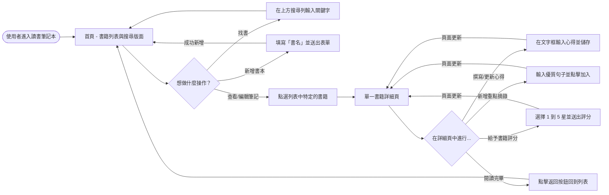
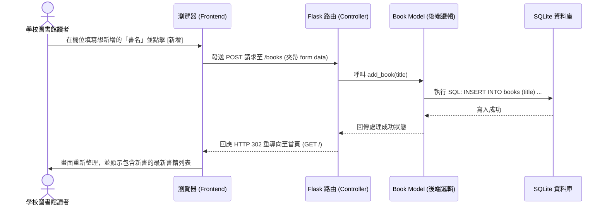

# 系統與使用者流程圖 (Flowchart) - 讀書筆記本系統

本文件依據產品需求文件 (PRD) 與系統架構文件 (Architecture)，整理出使用者操作系統的路徑，以及後端處理資料的系統程序，用以幫助開發團隊理解整體的互動邏輯。

## 1. 使用者流程圖 (User Flow)

這張圖呈現了讀者從進入系統開始，到對不同的功能進行操作時的使用者旅程路徑。

## 2. 系統序列圖 (Sequence Diagram)

這裡以「使用者新增一本書籍」這個經典的新增資料流程為例，展示在 MVC 架構下前端瀏覽器、Flask Controller、Model 與 SQLite 之間的資料流轉。

## 3. 功能清單對照表

此表定義了 PRD 中所提的各項主要功能與網頁 URL 路徑、HTTP 請求方法的對應關係，將做為後續開發 API 介面與路由設計的參考基礎。

| 功能名稱 | URL 路徑 | HTTP 方法 | 說明 |
| --- | --- | --- | --- |
| 瀏覽書籍列表 | `/` 或 `/books` | GET | 首頁，預設列出所有書籍筆記 |
| **可搜尋書籍功能** | `/books?search=<keyword>` | GET | 使用 Query String 來傳遞搜尋關鍵字，回傳過濾後的列表 |
| **記錄書名資訊** | `/books` | POST | 接收前端表單傳來的書名資料，並在資料庫內新增一筆紀錄 |
| 進入書籍詳細頁 | `/books/<int:book_id>` | GET | 顯示特定書籍的詳情（包含心得、評分與其所有摘錄） |
| **撰寫/編輯閱讀心得** | `/books/<int:book_id>/notes` | POST | 將使用者填寫的心得內容（與評分）更新至該書的資料表紀錄中 |
| **書籍評分機制** | `/books/<int:book_id>/notes` | POST | （通常與上方的撰寫心得共用同一表單同時儲存，亦可獨立設定） |
| **新增重點摘錄** | `/books/<int:book_id>/excerpts` | POST | 在該書籍底下新增一條重點知識或名言佳句（為一對多關聯） |

